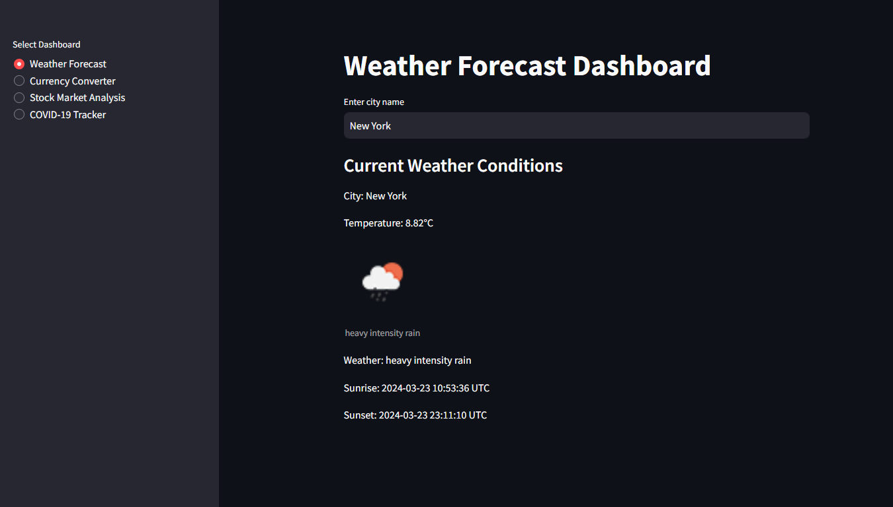

# InfoHub: Data Dashboard

InfoHub is a comprehensive data dashboard application built using Streamlit. It provides various functionalities related to weather forecasting, currency conversion, stock market analysis, and COVID-19 tracking.
deplyed here:- [INFOHUB](https://shiv000000-infohub-app-ziyzec.streamlit.app)


## Features

- **Weather Forecast Dashboard:** Get real-time weather information for any city worldwide.
- **Currency Converter Dashboard:** Convert currencies with live exchange rates.
- **Stock Market Analysis Dashboard:** Analyze stock market trends and data.
- **COVID-19 Tracker Dashboard:** Track COVID-19 statistics globally and by country.

## INSTALLATION

## Clone the repository

```bash
git clone https://github.com/SHIV000000/InfoHub.git
```

## Navigate to the project directory:

```bash
cd InfoHub
```
## Create a Virtual Environment

### For macOS/Linux:

```bash
python3 -m venv venv
```

### For Windows:

```bash
py -m venv venv
```

## Activate the Virtual Environment:

### For macOS/Linux:

```bash
source venv/bin/activate
 ```

### For Windows:

```bash
.\venv\Scripts\activate
```
## Install dependencies

```bash
pip install -r requirements.txt
```
## Run the Streamlit app:

```bash
streamlit run app.py
```
Access the app:
Open a web browser and go to http://localhost:8501

Technologies Used
Streamlit: For building the interactive web application.
Python: For backend development and data processing.
Requests: For making HTTP requests to fetch weather and currency data.
Pandas: For data manipulation and analysis.
Contributing
Contributions are welcome! If you have any ideas for improvements or new features, feel free to open an issue or submit a pull request.
